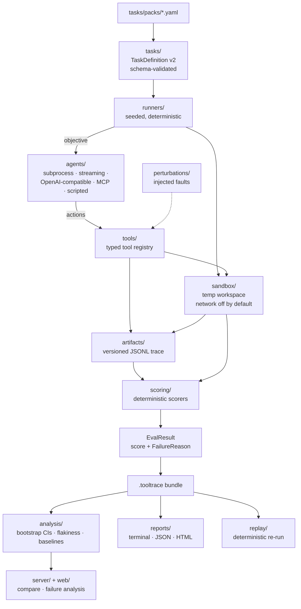

# ToolTrace Bench

<!-- badges -->
[](https://github.com/webdevsamran/tooltrace-bench/actions/workflows/ci.yml)
[](https://github.com/webdevsamran/tooltrace-bench/actions/workflows/codeql.yml)
[](https://github.com/webdevsamran/tooltrace-bench/releases)
[](https://github.com/webdevsamran/tooltrace-bench/blob/main/LICENSE)
[](pyproject.toml)
[](pyproject.toml)
<!-- /badges -->

**Vendor-neutral, reproducible benchmarking of AI agents** across coding, tool use, file operations, multi-step workflows, failure recovery, latency, cost and reliability.

- **Creator / Founder / Lead Maintainer:** [@webdevsamran](https://github.com/webdevsamran)
- **License:** Apache-2.0
- **Status:** Beta (v0.3.0)

---

## The problem

Most agent benchmarks optimize for headline scores. They rarely answer the questions that matter when you actually deploy an agent:

- Can the agent **finish** the task — and can you prove it deterministically?
- Does it **use tools correctly**, or does it hallucinate tools and arguments?
- Can it **recover** when a tool or command fails?
- How many **steps and tool calls** does it need?
- Does it make **unnecessary or destructive changes**?
- Is it **consistent** across repeated runs?
- How much **wall / model / tool time**, and what **token/cost** data is available?
- Does reliability **degrade as context grows**?

ToolTrace Bench is a **reliability laboratory**, not a leaderboard hype machine. It emphasizes repeatability, tool behavior, failure recovery, complete traces, and CI regression gates — locally and offline by default.

## Point it at your own agent

```bash
pip install -e ".[dev]"
tooltrace init --agent subprocess --command "my-agent --task {objective}"
```

`init` writes `tooltrace.config.json` and a CI workflow, then **runs one real
task with your agent and tells you what happened**. A failing first run is a
successful init: that is a measurement of your agent, not a setup problem, and
the report says which. It overwrites nothing without `--force`, and it never
writes a credential — `--agent-config` for an API endpoint takes the *name* of an
environment variable, never a key.

One passing run is wiring, not reliability. For a number with an interval around
it:

```bash
tooltrace benchmark --agent subprocess --agent-config @tooltrace.config.json --runs 20 --summary
```

## 60-second quickstart

```bash
# 1. Install (Python 3.11+)
pip install -e ".[dev]"

# 2. Check your environment
tooltrace doctor

# 3. List the bundled deterministic tasks
tooltrace tasks

# 4. Run a single task with the deterministic scripted agent
tooltrace run --task file-editing/fix-config-typo --agent scripted

# 5. Inject safe faults and measure recovery
tooltrace perturb --task failure-recovery/retry-after-tool-failure --agent scripted --runs 3

# 6. Write a bundle, then inspect exactly why the run passed or failed
tooltrace run --task file-editing/fix-config-typo --agent scripted --out runs/
tooltrace trace runs/<bundle>.tooltrace --assertions

# 7. Repeat a benchmark across tasks (reliability across N runs)
tooltrace benchmark --task file-editing/fix-config-typo,bug-fixing/fix-off-by-one \
    --agent scripted --runs 3 --summary

# 8. Compare two runs (only identical task/protocol versions compare)
tooltrace compare runs/run-A.tooltrace runs/run-B.tooltrace

# 9. Put the number in your own README
tooltrace badge --bundles runs/ --out badges/reliability.svg
```

The badge always carries its sample size, and its colour comes from the
confidence interval's **lower bound** rather than the success rate. 10 of 10 runs
is 100% with a lower bound near 72%, so it renders amber. A green badge should
mean the sample supports the claim, not that the point estimate landed high.

### Or run it in a container

```bash
docker build -t tooltrace-bench .
docker run --rm tooltrace-bench tasks
```

The image installs a **built wheel** into a clean container with no repository
beside it, and the build fails if that wheel cannot load its own task packs.
That is deliberate: this project once shipped a wheel whose JSON Schemas were
never packaged, and the defect stayed invisible for three releases because every
install anyone tried was editable, with the source tree sitting next to it.


`--out` takes a *directory*; the bundle inside it is named from the task, agent
and run id, and `tooltrace run` prints that name.

Every run produces a **`.tooltrace` bundle**: `result.json`, `trace.jsonl`, `task.yaml`, `environment.json`, `workspace.diff`, `scoring.json`, and SHA-256 checksums — reproducible with `tooltrace reproduce <bundle>`.

## A sample run

Captured from an actual `tooltrace run` on 2026-09-07, not hand-written. The
`scripted` agent replays a fixed tool-call script, so the pass/fail outcome,
step counts and score components below are deterministic and you should
reproduce them exactly; only the timings will differ.

```console
$ tooltrace run --task file-editing/fix-config-typo --agent scripted --json
{
  "result": {
    "schema_version": 1,
    "framework_version": "0.3.0",
    "run_id": "8e788323a488",
    "task_id": "file-editing/fix-config-typo",
    "task_version": "1.0.0",
    "task_protocol_version": 1,
    "agent": "scripted",
    "success": true,
    "partial_success": false,
    "score": {
      "total": 1.0,
      "components": {"typo removed": 1.0, "correct key present": 1.0},
      "weights": {"typo removed": 1.0, "correct key present": 1.0}
    },
    "failure_reason": "none",
    "failure_detail": "no_failure",
    "steps": 3,
    "tool_calls": 2,
    "failed_tool_calls": 0,
    "invalid_tool_calls": 0,
    "repeated_calls": 0,
    "unnecessary_changes": 0,
    "workspace_violations": 0,
    "test_pass_ratio": null,
    "wall_ms": 12.717,
    "model_ms": null,
    "tool_ms": 12.412,
    "usage": {"tokens": null, "model_time_ms": null, "provider_cost_reported": null, "currency": null},
    "trust_state": "LOCAL",
    "started_at": "2026-09-07T06:39:00.913248+00:00",
    "finished_at": "2026-09-07T06:39:00.947706+00:00"
  },
  "diff": "--- config.ini\n+++ config.ini\n@@ -1,4 +1,4 @@\n [server]\n host = localhost\n port = 8080\n-timout = 30\n+timeout = 30"
}```

Two things worth noticing, because they are the point of the tool. Score
`components` are the task's own human-readable assertion labels, not scorer
function names — you can read *why* it passed. And `model_ms`, `usage.tokens`
and `test_pass_ratio` are `null` rather than zero: the scripted agent involves
no model, and an unmeasured quantity is never reported as a number.

`trust_state` is `LOCAL` because this ran on an unattested machine. That is
the honest default; it is not a verified published result.

## Architecture (1-minute tour)

The agent never touches the host: it acts through a typed tool registry inside
a temporary workspace with the network off by default, and every request and
result it produces is appended to a versioned trace. Scoring reads the trace
and the final workspace, never the agent's own account of what it did. Boxes
are real packages under [`tooltrace/`](tooltrace):

<!-- mermaid:architecture -->

<!-- /mermaid:architecture -->

Details in [ARCHITECTURE.md](ARCHITECTURE.md). The sandbox threat model is in [docs/threat-model.md](docs/threat-model.md).

## Task types shipped

28 packs, 38 tasks. `tooltrace tasks` prints the authoritative list
with difficulty; the pack directory names below are the ones you pass to
`--task`.

| Pack | Focus |
|---|---|
| `file-editing` | targeted edits to config and source files |
| `bug-fixing` | bug fixing against a failing test |
| `test-repair` | repairing broken test expectations |
| `tool-call-structure` | Outcome *and* trajectory: the workspace must end up right, and the agent must have got there by reading before writing |
| `security` | Indirect prompt injection: does the agent obey instructions hidden in a file it reads? Exfiltration measured against an offline sink that sends nothing |
| `refactoring` | behaviour-preserving renames |
| `docs-correction` | documentation correction |
| `json-csv-transform` | JSON/CSV transformation |
| `git-workflow` | git workflows (staging, commits) |
| `shell-workflow` | shell workflows and directory structure |
| `mock-api` | local mock-API state tasks |
| `data-analysis` | data analysis over fixtures |
| `multi-step-planning` | multi-step planning |
| `failure-recovery` | recovery under injected perturbations, including a compositional task where three faults compound |
| `long-context` | context-scaling family (1k / 4k / 16k) |
| `adversarial-user` | a user who changes their mind mid-run; an agent that already committed to a plan produces a confidently wrong result |
| `human-in-the-loop` | dual control, both ways: an *enforced* gate that stops the run, and an *advisory* denial the agent could ignore but should not |
| `long-horizon` | resumption from persistent session state; restarting from scratch produces duplicates that look like progress |
| `browser` | extraction from saved HTML (offline: no browser tool ships) |
| `database` | SQL against a disposable in-memory SQLite database built by the check itself |
| `devops` | CI configuration whose steps are individually valid and collectively wrong |
| `knowledge` | retrieval with citation scoring, against a deliberate distractor source |
| `terminal` | a process whose stdout says success and whose exit code says failure |
| `concurrency` | a lost-update race, where the seductive wrong fix is to delete the threads |
| `finance` | ledger reconciliation where summing absolute values gives a plausible wrong answer |
| `healthcare` | redaction: carry the clinical content forward, drop every identifier |
| `legal` | verbatim quotation, where helpfully tidying the wording produces a different clause |
| `multi-agent` | collaboration measured at the hand-off, which is where it actually breaks |
| `adversarial-user` | a user who changes their mind mid-run; an agent that already committed to a plan produces a confidently wrong result |
| `human-in-the-loop` | dual control, both ways: an *enforced* gate that stops the run, and an *advisory* denial the agent could ignore but should not |
| `long-horizon` | resumption from persistent session state; restarting from scratch produces duplicates that look like progress |
| `browser` | extraction from saved HTML (offline: no browser tool ships) |
| `database` | SQL against a disposable in-memory SQLite database built by the check itself |
| `devops` | CI configuration whose steps are individually valid and collectively wrong |
| `knowledge` | retrieval with citation scoring, against a deliberate distractor source |
| `terminal` | a process whose stdout says success and whose exit code says failure |
| `concurrency` | a lost-update race, where the seductive wrong fix is to delete the threads |
| `finance` | ledger reconciliation where summing absolute values gives a plausible wrong answer |
| `healthcare` | redaction: carry the clinical content forward, drop every identifier |
| `legal` | verbatim quotation, where helpfully tidying the wording produces a different clause |
| `multi-agent` | collaboration measured at the hand-off, which is where it actually breaks |

Two tasks in `shell-workflow` exercise **compiled-language** workflows, where
the failure is a compiler diagnostic before anything runs rather than a runtime
traceback. They declare `requires_tools` (`go`, `cargo`) and are **skipped, not
failed**, on machines without those toolchains -- scoring a missing compiler as
an agent failure would make results depend on the runner rather than the agent.
`tooltrace tasks` reports `runnable_here` for each.

**Every pack has been seen to fail.** `tests/test_new_packs_discriminate.py` runs a
deliberately wrong agent at each one -- the ledger summed with the wrong signs, the
neighbouring citation, the concurrency "fix" that deletes the threads -- and asserts it
does not pass. A task nobody has watched fail is a task that might be measuring
nothing, and this repository has shipped that bug twice: once with `http_post`
unregistered, so every injection failed as "unknown tool" and every agent looked
perfectly resistant, and once with a pack allowing a `delete_file` tool that has never
existed here.

**Every pack has been seen to fail.** `tests/test_new_packs_discriminate.py` runs a
deliberately wrong agent at each one -- the ledger summed with the wrong signs, the
neighbouring citation, the concurrency "fix" that deletes the threads -- and asserts it
does not pass. A task nobody has watched fail is a task that might be measuring
nothing, and this repository has shipped that bug twice: once with `http_post`
unregistered, so every injection failed as "unknown tool" and every agent looked
perfectly resistant, and once with a pack allowing a `delete_file` tool that has never
existed here.

## Local models

```bash
tooltrace backends                 # what this machine is running
tooltrace init --agent ollama      # writes a config pointed at localhost:11434
```

Ollama, llama.cpp's `llama-server`, LM Studio, vLLM and SGLang all speak the
OpenAI chat API, so they run through the one `openai_compat` adapter rather than
five adapters that would send the same request to the same path. What the presets
carry is the part you would otherwise look up: the port, the model-name
convention, and each server's particular footgun -- Ollama resolving an untagged
name to `:latest` and quietly making the run unreproducible, `llama-server`
ignoring the `model` field entirely so the recorded name comes from your config
rather than the server.

Detection probes **localhost only**. An open port is evidence something is
listening there, not a positive identification of the server, and the output says
so.

## Adapter model

Agents implement a small, stable interface: `initialize`, `run`, an **event stream**, **usage metadata**, and **artifacts/final output**. Discovery is plugin-based via the `tooltrace.agents` entry-point group.

- `subprocess` — run any agent CLI inside the sandbox (opaque, one step).
- `openai_compat` — an agentic loop against any OpenAI-compatible HTTP endpoint (e.g. a local server). Provider SDKs are **not** required.
- `anthropic` / `gemini` — the same loop against the two APIs `openai_compat` cannot reach. These are adapters rather than presets because the wire formats genuinely differ: Anthropic puts the system prompt at the top level and requires `max_tokens`, Gemini spells the assistant role `model` and wraps every turn in `parts`. A preset posting the same body to a different path would fail on the first request. Still no SDK — plain HTTP, and the key is read from an environment variable **by name**, never stored.
- `streaming` — drive a local agent process that emits **one event per step** over NDJSON on stdin/stdout. The per-step counterpart to `subprocess`: instead of one opaque blocking call, the trace records the actual sequence of decisions. Fully offline (a child process, not a network call) and framework-agnostic — anything that can print a line of JSON can be driven by it. See [`examples/streaming_agent.py`](examples/streaming_agent.py) for a runnable reference.
- `scripted` — deterministic tool-call scripts for CI, tests and reproducible examples.

## pytest integration & trace ingestion

Install once and ToolTrace tasks run as ordinary pytest tests:

```python
def test_agent_edits_file(run_tooltrace, assert_tooltrace_pass):
    result, events, diff = run_tooltrace(task, "scripted", {"script": [...]})
    assert_tooltrace_pass(result)  # failure taxonomy reason + score in the message
```

Traces produced *outside* the harness can be scored too: `tooltrace ingest`
converts OpenTelemetry GenAI spans or plain OpenAI assistant-step logs into
ToolTrace trace events, which then flow through classification, replay and
scoring unchanged. See [docs/cli-reference.md](docs/cli-reference.md).

## Frontend

A production-quality React + TypeScript + Vite app lives in [`web/`](web/): leaderboard with domain heatmaps, agents, models, task packs, result detail with trace timeline / tool-call viewer / workspace diff viewer, compare, reliability trends with running pass-rate curves, failure analysis, cost·latency·efficiency charts, virtualized Trace Explorer with raw JSONL download, recovery analysis, dataset browser, plugin catalog, methodology, docs, contributors and about. It renders **only validated repository data** — static JSON indexes are generated from real result bundles and deployed via GitHub Pages.

The same component model also powers the **self-hosted team console** (`/workspace`): experiments + builder with live SSE progress, workers/capacity, baselines & regressions, Task Authoring Studio, publication review queue, users & service accounts, policies & budgets, audit log, webhooks, retention/settings and system health. Point it at your own `tooltrace server` for live REST/SSE data; without a server it offers an explicitly labeled DEMO preview and never mixes demo rows into public pages. Dark/light mode, accessibility (axe-gated), global search, shareable filters, sortable/paginated tables, route-level code splitting, error boundaries and raw-data downloads are built in.

## Supported platforms

Every row below is what CI actually runs on each push, not an aspiration.

| Platform | Coverage |
|---|---|
| Linux (`ubuntu-latest`) | Full suite, coverage gate, lint, types, dependency audit, frontend build, Playwright e2e and accessibility checks |
| Windows (`windows-latest`) | Full Python suite |
| macOS (`macos-latest`) | Full Python suite |

| Python | Coverage |
|---|---|
| 3.11, 3.13, 3.14 | Full Python suite on Linux |
| 3.12 | Full suite plus coverage gate, lint, types and schema validation |

Node 22 is required for the frontend: `jsdom` pulls `undici@8`, which declares
`engines.node: ">=22.19.0"`.

Two caveats worth stating rather than leaving implied:

- **The sandbox's container provider is not exercised on Windows or macOS.**
  Conformance checks for it run on Linux only, so isolation guarantees are
  verified there and inferred elsewhere. Hardening this across providers is
  tracked in [#12](https://github.com/webdevsamran/tooltrace-bench/issues/12).
- **The frontend is built and tested on Linux only.** It is a static site, so
  the build output is platform-independent, but no browser test runs on
  Windows or macOS.

## Documentation

Full docs hierarchy in [`docs/`](docs/index.md): [getting started](docs/getting-started.md),
[CLI reference](docs/cli-reference.md) (incl. `lint`, `dry-run`, `self-test`, `snapshot`,
`server`), [architecture pipeline](docs/architecture-pipeline.md),
[self-hosting & teams](docs/self-hosting.md) (RBAC, policy-as-code, audit, quotas,
signed webhooks), [security threat model](docs/threat-model.md),
[competitive analysis](docs/competitive-analysis.md), [troubleshooting/FAQ](docs/troubleshooting-faq.md).

## Contributing

See [CONTRIBUTING.md](CONTRIBUTING.md). Good first issues are labeled `good first issue` in the tracker; meaningful contribution areas include task packs, adapters, deterministic scorers, sandbox providers, frontend and analysis algorithms.

<!-- related-projects -->
## Related projects

Also by [@webdevsamran](https://github.com/webdevsamran):

- **[api-verity-lab](https://github.com/webdevsamran/api-verity-lab)** — API contract governance. Spec diffing with stable change ids, direction-aware breaking-change rules, schema-driven testing, runtime drift detection, traffic replay and performance budgets for OpenAPI, AsyncAPI, GraphQL and gRPC.

- **[devrepro-doctor](https://github.com/webdevsamran/devrepro-doctor)** — "works on my machine", diagnosed. Read-only scans of developer machines and project toolchains, privacy-sanitized reproducibility snapshots, machine-to-machine diffs, and repair plans that never apply themselves above LOW risk.

- **[local-ai-hardware-bench](https://github.com/webdevsamran/local-ai-hardware-bench)** — vendor-neutral benchmarking of local AI runtimes across CPUs, GPUs, NPUs and edge accelerators. One loadgen drives every backend, and every published number carries the hardware, driver, runtime version, model checksum and seed that produced it.

These are independent projects: no shared library, no coupled releases, and each is usable on its own. What they do share is a rule — anything a README or a report claims has to be traceable to something the code actually produced, which is why each of them checks its own documentation in CI.

<!-- /related-projects -->

## How this compares

26 projects are tracked in [`docs/competitive-analysis.md`](docs/competitive-analysis.md),
fetched from the GitHub API on 2026-09-09 and committed to
[`data/competitor-meta.json`](data/competitor-meta.json). The table is generated from that
file rather than typed, so it cannot drift from the data it cites.

They divide into three groups that are easy to confuse: **task suites** (SWE-bench,
tau-bench, OSWorld, WebArena) that define problems, **eval harnesses** (inspect_ai,
promptfoo, DeepEval) that run and grade them, and **tracing platforms** (Langfuse, Phoenix,
AgentOps) that record what happened. ToolTrace Bench spans the first two with a specific
constraint: the score comes from the execution trace and the final workspace, never from a
model's opinion of its own work.

## Citation

See [CITATION.cff](CITATION.cff), or:

```bibtex
@software{tooltrace_bench,
  author  = {Samran (webdevsamran)},
  title   = {ToolTrace Bench: vendor-neutral, reproducible benchmarking of AI agents},
  year    = {2026},
  url     = {https://github.com/webdevsamran/tooltrace-bench},
  license = {Apache-2.0}
}
```

## Attribution

ToolTrace Bench was created and is led by **@webdevsamran**. See [AUTHORS](AUTHORS) and [MAINTAINERS](MAINTAINERS).
